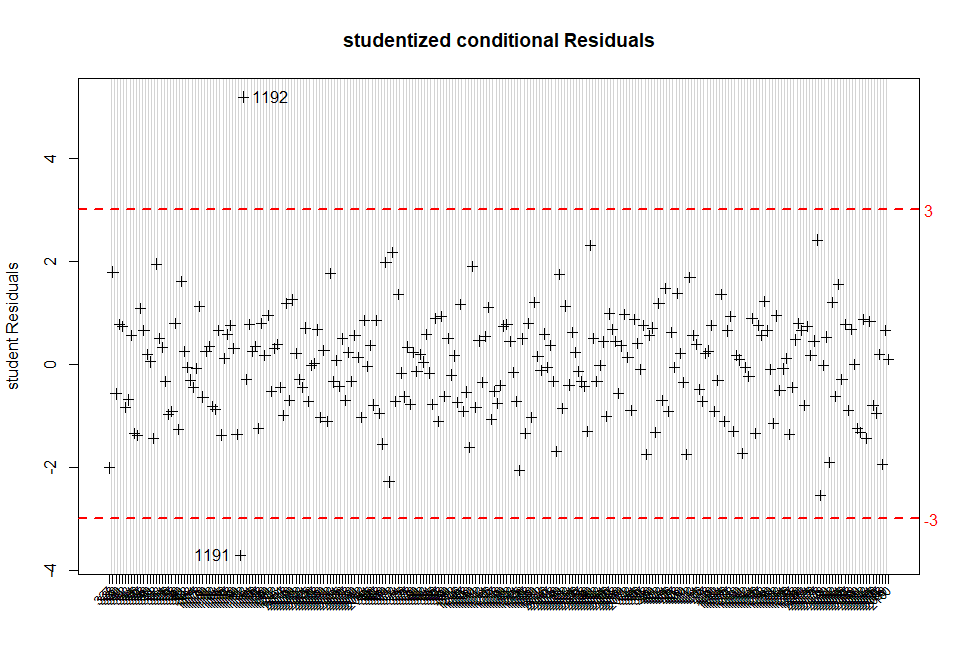
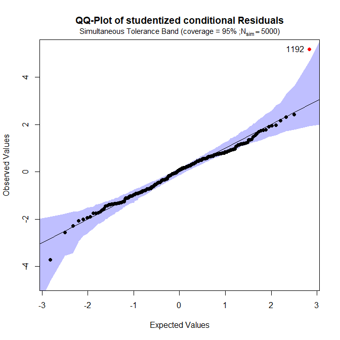
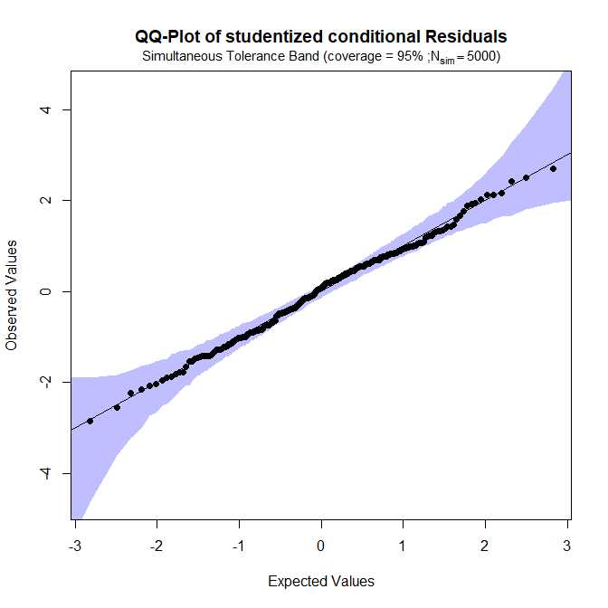

```{r global_options, echo=FALSE, eval=TRUE}
knitr::opts_chunk$set(fig.width=7, fig.height=5, fig.align='center', fig.path='figures/',
                      echo=TRUE, eval=TRUE, warning=FALSE, message=FALSE)
```


```{r create_data, echo=FALSE}
library(VCA)
library(STB)
library(VFP)
data(VCAdata1)
datS5 <- subset(VCAdata1, sample==5)
# limit number of decimal places
options(digits=4)
```  


# Introduction  

The main objective of R-package **VCA** is to perform variance component
analyses (VCA). VCA is a way to assess how the variability of a dependent
variable is structured taking into account its association with one or multiple
random-effects variables. Proportions of the total variability found to be
attributed to these random effects variables are called *variance components*
(VC). Thus, VCA is the procedure of estimating the amount of the VCs'
contribution to the total variability in the dependent variable. Moreover, there
are methods provided for estimating confidence intervals (CI) of VCs along with
different graphical tools to better understand the data and for detecting
outliers. Also included, but usually of less importance in the field of VCA:
Estimation of fixed effects and least square means (LS means) as well as testing
linear hypotheses of fixed effects/LS means of linear mixed models (LMMs).

VCs can be predicted in random models (*random effects* or *variance component
models*) and LMMs (*linear mixed -effects- models*) by application of either
*analysis of variance* (ANOVA)-type estimation or *Restricted Maximum
Likelihood* (REML). Experiments of this type frequently occur in performance
evaluation analyses of diagnostic tests or analyzers (devices) quantifying
various types of measurement (im)precision (see e.g. *CLSI EP05-A3* guideline).
In this setting it is important to point out that precision and imprecision both
refer to the variability of measurements and differ only by their respective
point of view, i.e. the larger the precision of a measuring method the smaller
is its imprecision and vice versa. Not that (im)precision is the random error
component in the total analytical error (TAE) concept, which is added to
systematic error quanitified as bias to obtain TAE.

In the course of the discussion of R-package **VCA**, several examples will be
given to allow the user to better understand the application of the most
important functions. For all of the examples, simulated data sets coming with
the R-package will be used. One of these, **VCAdata1**, comprises 2520
observations. There are 6 variables for 3 devices (*device*), 3 lots (*lot*), 10
samples (*sample*), 21 days (*day*) and 2 runs within day (*run*) with 2
replicates per run. This means, for each run two measurements (y) were performed
under conditions which are as constant as they can get. One commonly speaks of
*repeatability* measurement conditions.  
  
  
<!-- show structure of VCAdata1 -->
```{r str_VCAdata1, echo=FALSE} 
str(VCAdata1)
```
For all other data sets used in this document please refer to the description
that can be found in R-package **VCA**. In the next section it is shown how
easy it is to perform a VCA, including a compact summary and visualization of
the variabiliy over the concentration range covered.


# Getting Started

In this section we show how easy it is to perform a precision analysis using
the R-package **VCA**. We will make use of the dataset **VCAdata1**. Here, we
use function **anovaVCA** for Type-1 ANOVA-estimation of mean squares from which
variance components can be derived, but one could also use function **remlVCA**
which performs a VCA based on restricted maximum likelihood methodology.

Dataset **VCAdata1** consists of 10 samples covering the range of some analyte
of interest. For each of these 10 samples the same VCA-model has to be used. We
can fit this model on all 10 samples using the argument **by** which accepts a
grouping variable.

<!-- show structure of VCAdata1 -->
```{r anovaVCA_by, echo=TRUE} 
fits <- anovaVCA(y~(device+lot)/day/run, Data=VCAdata1, by="sample")

# which class is 'fits'?
class(fits)

# which class are the elements of this list
sapply(fits, class)
```
  
At this point the easiest way to summarize the complete analysis for each
sample is to use function **summarize.VCA**. This function will call function
**VCAinference** on each VCA-object (sample) deriving 95% CI of variance
components and extract all important information into a matrix. Note, that it
can be configured to either restrict the extracted information to a subset that
is of interest or to gather and tabulate all information available.

<!-- show structure of VCAdata1 -->
```{r summarize_VCA, echo=TRUE}
# use default settings and suppress printing 
smry <- summarize.VCA(fits, print=FALSE)

# round results to 4 digits
smry <- apply(smry, 1:2, round, digits=4)

# show only the first 5 of 10 samples
smry[,1:5]
```

One can summarize the entire VCA on all 10 samples also graphically. This is
done using so called precision profiles which are non-linear functions of the
mean concentrations of tested samples with variance as dependent variable.
R-package **VFP** offers this functionality and seamlessly transforms the list
of **VCA**-object into a precision-profile. Precision profiles are most
commonly depicted on coefficient of variation scale. In fact they can be seen
as visualization of the table above, closing the gaps in-between
mean-concentrations of the 10 samples. More details can be found in the
vignette of R-package **VFP**.

```{r fit_precision_profile, echo=TRUE}
# fit 9 models to list of VCA-objects, note that total is automatically selected,
# use argument 'vc' to use e.g. repeatability as 'vc="error"'
pp.total <- fit.vfp(fits, 1:9)
```

```{r precision_profile, fig.width=10, fig.height=7}
# if no model is specified via 'model.no' the best-fitting model will be used
# by 'type="cv"' the variability-scale is set to CV
plot(pp.total, type="cv", ylim=c(0, 40))
```

In the next section you will see how to visualize precision-analysis data. 
  
# Visualization of Variability via Function *varPlot*  

Visualization can often help in understanding new or unknown data. When performing a *VCA* it is highly
recommended to initially take a look at a variability chart to better understand the major sources of variability
and to get a rough idea of the general total variability to expect. Moreover, the variability chart can help
spotting abnormalities such as outliers in the data, i.e. extreme values that lie an abnormous distance from
the other remaining values and therefore are likely to have a negative effect on the analysis and possible lead
to invalid results (see sections *Outlier Detection* and  *Checking Normality and Extreme Values Using R-Package
STB*).

## Default Settings

**VCA** provides a function called **varPlot** for generating such a variability chart. To create a variability chart
by *varPlot()*, it is necessary to state the model formula as well as the data set as function parameters. In this
first example, a variability chart for a random model of the form y~(device+lot)/day/run will be plotted. All
effects in a *VCA* are modeled as random since the interest lies in their distribution, i.e. their contribution
to the total variability (variance). *Run* is nested within *day*, and *day* is, according to the model formula,
nested within combinations of *lot* and *device*. Please note that in *varPlot()* the real model is not relevant
but rather the order of the variables which determines the layout of the table depicted at the bottom of the
variability chart. The implementation of the variability chart cannot distinguish between nested and crossed
terms. The data that is used for drawing the variability chart is **datS5**, a subset of *VCAdata1* consisting
only of 252 observations from sample number 5 from a total of 10 samples: 


Given the parameters **form** and **Data** only,
*varPlot()* creates the variability chart in a plain design:  

```{r varPlot_plain, fig.width=10, fig.height=7}
varPlot(form=y~(device+lot)/day/run, Data=datS5)
```  

Note, that using function **varPlot** is equivalent to plotting a fitted model
via **plot(VCAobject)**. In fact, function **varPlot** is called but it is
sometime more convenient to just use the standard plot-method for
**VCA**-objects.

```{r plot_VCA, fig.width=10, fig.height=7}
plot(fits[[5]], Title=list(main="Variability Chart via 'plot.VCA'"))
```  

The variability chart shows all 252 observations in *datS5* according to the nesting structure of the model formula. 
Again, this equals 3 devices (bottom line) with 3 lots each (second from bottom), 7 measuring days (third from bottom) 
per lot and 2 runs per day. Since each run consists of two replicates, these two values are drawn and connected by a 
vertical line highlighting the complete range of replicated measurements. Whenever measurements are performed 
under identical conditions (replicated), i.e. no other sources of variability have an influence, the variance of residual 
error will be inferred from these differences. In the setting of in-vitro diagnostics one speaks of *repeatability*
variance meaning the pure assay (im)precision.

## Advanced Settings

It is possible to specify the display of further graphical elements in the variability chart using various style
parameters to improve the overview and facilitate information extraction. Almost all parameters correspond
to list-type objects. This allows very detailed specification of the graphical appearance, e.g. in the parameter
*MeanLine* variables can be selected whose mean-values are to be highlighted as horizontal lines, their colors
(*col*), line-width (*lwd*), line-type (*lty*) etc.. In fact, all function arguments accepted by the R-function *lines*
can be specified, since the list *MeanLine* is passed forward to *lines()* with some modifications taking place
beforehand. 

In the next example, horizontal lines for mean-values (*MeanLine*) are drawn for the intercept
as well as the factors *device* and *lot*. Via list-element *col* the appropriate colors are set to white, blue and
magenta. Using list-element *lwd* allows to change the line width of the mean value horizontal lines. The
allocation of style parameter settings to the respective graphical elements/variables is done in accordance
with the order of element denomination. Furthermore, the three levels of variable *lot* will be highlighted in
different shades of gray using function argument *BG*, which also needs to be specified as list:  

<!-- print and run code for creating an edited variability chart -->
```{r varPlot_full, fig.width=10, fig.height=7}
varPlot(y~(device+lot)/day/run, datS5, 
		MeanLine=list(var=c("int", "device", "lot"), 
					  col=c("white", "blue", "magenta"), lwd=c(2,2,2)), 
		BG=list(var="lot", col=paste0("gray", c(70,80,90))))
```  

# Outlier Detection

## Outlier Detection by Visual Inspection 

From looking at the variability chart it is noticeable that there is one pair of measurements that deviates
remarkably far from its within-run mean, i.e. the small red cross on the line connecting the values vertically.
These two potential outliers are the replicates of run 2 on day 4, measured in lot 2 with device 1. Extreme
values might negatively influence (violate) the normality assumption applied for all random variates of a
linear mixed effects model (i.e. random effects, residuals). Thereby, outliers can influence the validity of
the model and its results. Following commented R-code is used to generate the variability chart with the
potential outliers highlighted:

```{r varPlot_Outlier, fig.width=10, fig.height=7}
#indicate outliers by new variable
datS5$out <- 0
datS5$out[which(datS5$device==1 & datS5$lot==2 & datS5$day==4 &datS5$run==2)] <- 1

varPlot(y~(device+lot)/day/run, datS5,
		# plots horizontal lines for sub-sets
		MeanLine=list(	var=c("int", "device", "lot"),
						col=c("white", "blue", "magenta"),
						lwd=c(3,3,3)),
		# colors the background according to a variable's levels
		# 'col.table=TRUE' indicates the variable in the table 
		BG=list(var="lot", col=paste0("gray", c(70,80,90)),
				col.table=TRUE),
		# tailoring the appearance of measurements (points)
		Points=list(pch=list(var="out", pch=c(21, 24)),
					col=list(var="out", col=c("black", "red")),
					bg= list(var="out", bg=c("white", "yellow")),
					cex=list(var="out", cex=c(1, 1.5))),
		# specification of the text within the table below
		VarLab=list(list(cex=1.75), list(cex=1.5),
					list(cex=1, srt=90), list()),
		# variable names right of the table (since 'side=4')
		VCnam=list(cex=1.25, side=4),
		# use 33% of the height of the upper part for the table
		htab=.33)  
``` 

The function argument *Points* can also be used as list of arguments passed forward to function *points()*. But
it can be used in a more detailed manner letting the user specify list-elements *pch*, *col*, *bg*, and *cex* as lists
themselves. By doing so one can incorporate additional information indicated by different plotting symbols,
color, and size of the symbols. Element *bg* is only useful in case of setting *pch* equal to 21-25. Then, *col* is interpreted
as the color of the border and *bg* as the background color of these symbols (see also the last example of the
varPlot help).

## Outlier Detection Using Studentized Residuals

Studentization of residuals and/or random effects transforms these random variates to have mean zero and
standard deviation (SD) equal to 1 using their element-wise variance estimates for standardization. Outliers
amongst studentized conditional residuals correspond to outliers on the replicate level, i.e. where all measuring
conditions are kept as constant as possible (here: *device*, *lot*, *day* and *run*). Studentized conditional residuals
can be assessed and plotted by the **VCA**-function **plotRandVar**. *plotRandVar()* requires a fitted model
as input. In addition, the parameter *term* specifies the type of residuals whereas the parameter
*mode* specifies the transformation to be applied to the residuals.  

There are two options available for fitting a variance component model. One can use either ANOVA-type estimation via function **anovaVCA** or
REML-estimation via function **remlVCA**. For balanced data and in situations where ANOVA-estimation
does not produce negative variance-estimates, both methods generate identical results. Otherwise, both
approaches to  estimation of random effects, and therefore VCs, are likely to differ. Although this
difference is usually small. We are using ANOVA-type estimation here but all statements are also valid
for REML-estimation. Note that there is function **fitVCA** wrapping function calls to anovaVCA and
remlVCA.

Fitting the model to the data returns the object *fitS5* of class **VCA**:  
  
<!-- only print code to output -->
```{r plotRandVar_fake, eval=FALSE}
fitS5 <- anovaVCA(y~(device+lot)/day/run, datS5)
# if varPlot was called before, better shut down the old graphics device
# graphical parameters were not reset to allow the user to add further
# information to the variability chart, which would not be possible otherwise
dev.off()
plotRandVar(fitS5, term="cond", mode="student")
```  

Residuals that deviate further than 3 times the standard deviation can
be considered as *extreme*, since the expected value of the mean after
studentization is equal to 1. Thus, only 0.3\% of all observations are expected
to be outside of the $+/- 3 \times SD$ interval. There are two values that come into
question as can be seen in the plot drawn by *plotRandVar()*:  

<!-- only run code for model fit and  -->
```{r plotRandVar, echo=FALSE, fig.width=10, fig.height=7}
fitS5 <- anovaVCA(y~(device+lot)/day/run, datS5)
plotRandVar(fitS5, term="cond", mode="student")
abline(h=c(-3, 3), lty=2, col="red")
mtext(side=4, at=c(-3, 3), col="red", line=.25, las=1, text=c(-3, 3))
```  

However, since there are too many values, the labelling of the x-axis has
become unclear. Setting the function's parameter **pick** to TRUE
allows selecting specific residuals by clicking on them within the graphics
device window:  

<!-- only print code to output -->
```{r plotRandVar_pick_fake, eval=FALSE}
plotRandVar(fitS5, term="cond", mode="student", pick=TRUE) 
abline(h=c(-3, 3), lty=2, col="red", lwd=2)
mtext(side=4, at=c(-3, 3), col="red", line=.25, las=1, text=c(-3, 3))
```  

For every value selected in the plot the respective row name within the data
set will be displayed next to the value:  


```{r, plotRandVar_picked, echo=FALSE}

```
<!-- [](figures/plotRandVar_pick.pdf) -->

*Please note*: After having selected the desired data points, the graphics
procedure has to be stopped manually by right-clicking on the graphics
device output and selecting "Stop" in order to be able to execute
further arguments within the R-console.  

To double-check whether the manually picked data points really are the
replicate measurements initially verified from sighting the variability
chart, simply select these observations using their row names:  

<!-- print code and result to output -->
```{r picked_observations} 
datS5[c("1191","1192"),]
```  

In fact, these observations are the ones initially suspected. The values should be considered for exclusion
from the data set to prevent invalid results. See *Checking Normality and Extreme Values Using R-Package
STB* for further methods that help determine whether these observations really have to be excluded in view
of the normality assumption. 


## An Outlier Detection Algorithm

Extreme values on the replicate-level are supposed to be detected by means of the Grubbs-test (CLSI
EP05-A3). A modified version of *Grubbs*-test may be defined by means of the median and the **MD68**-statistic.
The median can be seen as the robust version of the mean which is known to be sensitive to outliers, thus
itself biased in case real outlying observations exist. The *MD68* can be seen as the robust version of the SD,
defined as follows:

```{r define_MD68}
# Function computing the MD68 using SAS PCTLDEF5 quantile definition.
# x (numeric) values from which the MD68 shall be computed
# na.rm (logical) TRUE = missing values will be excluded automatically
md68 <- function(x, na.rm=FALSE)
{
	stopifnot(is.numeric(x))
	Med 	<- median(x, na.rm=na.rm)
	Diff 	<- abs(x-Med)
	MD68 	<- quantile(Diff, probs=.68, type=2)
	MD68
}
``` 

The critical value for this robust version of the *MD68*-based outlier detection algorithm was found to be
reasonably well working when set equal to $2.75 \times MD68$. Specifically, the deviation on the replicate-level
from the median of the respective replicate group may not exceed a $2.75 \times MD68$. The replicate groups in
our running example are always within *run* as the smallest grouping-variable where constant measuring conditions
can be assumed. The application of this outlier-detection algorithm should be done in groups where so called
intermediate precision measuring conditions exist. In the example this refers to a single lot on a single device,
i.e. nine such groups exist here (3 devices x 3 lots). For each of these nine groups the specific *MD68*-estimate
should be computed and the observation-specific deviation from the median of the replicate group should be
compared to the critical value of $2.75 \times MD68$.

```{r Outlier_Detection_Algorithm}
# identify groups of intermediate precision (IP) measuring conditions
datS5$IPgroup <- paste(datS5$device, datS5$lot, sep="_")
# uniquely identify replicate groups within IP-groups
datS5$RepGroup <- paste(datS5$day, datS5$run, sep="_")

# Define a function performing the MD68-based outlier-algorithm.
# The data.frame will be returned with two additional variables,
# "diff" (absolute differences from the replicate-group median) and
# "outlier" (TRUE = outlier, FALSE = no outlier).
#  
# obj 		(data.frame) with at least two variables
# resp 		(character) name of the numeric response variable
# RepGroup 	(character) name of the replicate-grouping variable
  
md68OutlierDetection <- function(obj=NULL, resp=NULL, RepGroup=NULL)
{
	stopifnot(is.data.frame(obj))
	cn 		<- colnames(obj)
	stopifnot(is.character(resp) && resp %in% cn && is.numeric(obj[,resp]))
	stopifnot(is.character(RepGroup) && RepGroup %in% cn)
	MD68 	<- md68(obj[, resp])
	Crit 	<- MD68*2.75
	# tapply returns a list with as many elements as there are unique
	# elements in obj[,RepGroup], which must be converted to a vector
	obj$diff <- unlist(
					tapply(obj[,resp], obj[,RepGroup],
					function(x)
					{
						m <- median(x)
						d <- abs(x - m)
						d
					}))
	obj$threshold 	<- Crit
	obj$outlier 	<- obj$diff > Crit
	obj
}
```

To apply this *MD68*-based outlier detection algorithm to the data, IP-group by IP-group, one can use a
simple for-loop. The result is data.frame out which has three additional variables (*threshold*, *diff*, and *outlier*).

```{r Outlier_Detection_Example}
IPgroups <- unique(datS5$IPgroup)
for(i in 1:length(IPgroups))
{
	tmpData <- subset(datS5, IPgroup == IPgroups[i])
	if(i == 1)
		out <- md68OutlierDetection(tmpData, resp="y", RepGroup="RepGroup")
	else
		out <- rbind(out, md68OutlierDetection(tmpData, resp="y", RepGroup="RepGroup"))
}
head(out)


# Were there any outliers detected?
any(out$outlier)
```

The expression shown above states that no element of variable *outlier* takes the value *TRUE*, i.e. no outlier
was identified. As one can see by thoroughly inspecting the **R** source-code, for these data the outlier detection
algorithm seems to suffer from relatively large between-day and between-run variability. Both contribute to
the total variance within IP-group 1_2 additionally to the measurement imprecision, which is reflected in a
rather large threshold value $2.75 \times MD68 = 1.624$. In consequence, this results in not detecting the previously
identified two observations *1191* and *1192* which deviate substantially from each other under repeatability
conditions. The above outlined extreme value detection is thus rather conservative, i.e. replicates have to
differ a lot in order to be termed extreme.


## Exteme Values on all Levels

Outliers may occur on all levels in an LMM, other levels than replicates should be assessed using
studentized random effects.
This is possible by specifying the desired random effects term in the *term* parameter of *plotRandVar()*. The
exact term denomination can be obtained from the ANOVA-table visible when printing the *VCA*-object. It is
also part of the VCA-object fitS5 :

```{r Show_VCA_Result}
# use non-default number of decimal places 
print(fitS5, digits=4)
```

As an example, consider the studentized random effects of "device:lot:day". This reveals the between-day variability:

```{r RandomEffects_Day, fig.height=7, fig.width=10}
plotRandVar(fitS5, term="device:lot:day", mode="student")
```

As well as the studentized random effects of "device:lot:day:run", which show the within-run variability:

```{r RandomEffects_Run, fig.height=7, fig.width=10}
plotRandVar(fitS5, term="device:lot:day:run", mode="student")
```  
  
**Please note:** If there are too few factor levels (here e.g. for *device* and *lot* with 3 levels each), the assessment
of studentized random effects is only of limited use.


```{r ANOVAtable_fake, eval=FALSE}
fitS5$aov.tab
```  

```{r ANOVAtable, echo=FALSE}
as.data.frame(fitS5$aov.tab)
```  
  
  
# Checking for Normality and Extreme Values Using R-Package **STB**

As indicated before in section *Outlier Detection*, it is assumed that random
factors are stochastically independent and random effects are normally
distributed. However, extreme values, i.e. outliers, can violate this
normality assumption and therefore distort estimations. The rule of thumb is to
exclude as few observations as possible and as many as necessary, i.e. generally
a maximum of two outliers that violate the normality assumptions at most.  

A reasonable means to visually check for observations or extreme values that
violate this assumption is to draw a **Q-Q plot** (quantile-quantile plot).
In this context, the Q-Q plot computes the theoretically expected random
variates (i.e. random effects or residuals) given a normal distribution. This
results in a straight diagonal line. Then the observed random variate values are
drawn against the expected values. If the observed values evidently deviate from
the straight diagonal line, the data most likely are not normally distributed.
An additional aid in visually determining if observations violate the normal
assumption is to add tolerance bands to the Q-Q plot.  

R-package **STB** (https://CRAN.R-project.org/package=STB)
provides function **stb.VCA** which simulates *N*data sets incorporating the variance-
covariance structure of a fitted object of class *VCA* and constructs a 100(1-alpha)%
simultaneous tolerance band (STB) for the simulated data. The *STB* is based on random
variates exctracted from the *N* simulated data sets. The
construction of the tolerance band requires a reasonably large number of
simulations to calculate sufficiently exact STB [see @Schuetzenmeister2012]. In the
following example, simultaneous tolerance bands from studentized (*mode*)
conditional (*term*) residuals extracted from 5000 simulated data sets (**N**)
are created using method *stb* for objects of class *VCA*. To do so, an LMM fit for *datS5* is required. By
way of example, all model terms are assumed to be random:  


```{r STB_construction, eval=FALSE}
set.seed(23)
fitS5.LMM <- anovaMM(y~((device)+(lot))/(day)/(run), datS5)
STB.res <- stb(fitS5.LMM, term="cond", mode="student", N=5000)
```  

```{r, STB_picked1, echo=FALSE, fig.align="center"}

``` 
<!-- [](figures/STB1.pdf) -->

  
One can clearly see that there is one observation in the top right corner lying
outside of the tolerance band. Applying the generic R-function **plot** to the
object *STB.res* created above and setting its parameter *pick=TRUE*
will allow for manual selection of observations by clicking on them within
the graphics device window - just as shown in the example above when
discussing the variability chart:  

```{r STB_picked_obs_fake, eval=FALSE }
plot(STB.res, pick=TRUE)
```  

```{r, STB_picked2, echo=FALSE, fig.align="center"}

```  

<!-- [](figures/STB1_pick.pdf) -->

Since observation 1192 is violating the normality assumption, it is removed
from the original data set and the STB is calculated again. First a *VCA*-object
has to be generated fitting a model, here, using function **anovaMM** designed to
fit linear mixed models. Terms intented to be modeled as random have to be enclosed
in parantheses indicating this:  

```{r delete_obs1_1, eval=TRUE}
datS5.reduced <- datS5[!rownames(datS5) == "1192",]
fitS5.reduced <- anovaMM(y~((device)+(lot))/(day)/(run), datS5.reduced)
```  

```{r delete_obs1_2, eval=FALSE}
STB.res2 <- stb(fitS5.reduced, term="cond", mode="student", N=5000)
```  

```{r, STB_obs_removed, echo=FALSE, fig.align="center"}

```  

<!-- [](figures/STB2.pdf) -->

As it turns out, removing only the observation 1192 already results in a
QQ-plot that obviously does not show any indications for the violation of the
normality assumption anymore. To double check another plot of studentized
conditional residuals is created from the fitted model of the reduced data set:  

```{r plotRandVar2, fig.height=7, fig.width=10}
plotRandVar(fitS5.reduced, term="cond", mode="student")
```  

In fact, observation 1191 of the initially (see section *Outlier Detection*) suspected value pair does
not have to be excluded from the data set anymore.  

Excluding too many observations potentially leads to inaccurate estimates
since information is lost. On the other hand, not excluding observations that
should be removed from the data because of violating the normality
assumption leads to invalid estimates. Once again, the following ANOVA
table shows the estimates that result from fitting the original full data set
*datS5* still containing observation 1191 and 1192. Pay special attention to
the error's contribution to the total variability (see *\%Total* column):  

```{r ANOVAtable_full, echo=FALSE}
as.data.frame(fitS5$aov.tab)
```  

Removing only observation 1192, since it caused the violation of the normality
assumption, results in the following estimates. Note how the *error \%Total*
reduced from 12.83\% before to 10.64\% now:


```{r ANOVAtable_reduced, echo=FALSE}
as.data.frame(fitS5.reduced$aov.tab)
```

# Commonly Used VCA-Models

In this section we want to give an overview on the most commonly used VCA-models. The *CLSI EP05-A3*
guideline describes multiple experimental settings, e.g. the single-site evaluation study and the multi-site
evaluation study. Here, we show how these experiments can be analyzed using R-package **VCA**.

## $20 \times 2 \times 2$ Single Site Evaluation

The single site experiment recommended in the CLSI EP05-A3 consists of 20 days, 2 runs per day with 2
replicates per run ($20 \times 2 \times 2 = 80$).

```{r WithinLab_Example_plot, echo=TRUE, fig.height=7, fig.width=10}
# Function converts a color-string into RGB-code
# col (character) string specifying an R-color
# alpha (numeric) degree of transparency in [0, 1], 0=fully transparency, 1=opaque
asRGB <- function(col, alpha)
			rgb(t(col2rgb(col))/255, alpha=alpha)
			
data(dataEP05A2_3)

varPlot(y~day/run, dataEP05A2_3,
	# controls horizontal mean lines
	MeanLine=list(var=c("int", "day"), col=c("gray75", "blue"), lwd=c(2,2)),
	# controls how points (concentrations) are plotted, here using semi-transparency
	# to see overlayed points
	Points=list(pch=16, col=asRGB("black", .5), cex=1.25),
	# controls how replicate-means are plotted
	Mean=list(col="magenta", cex=1.25, lwd=2),
	# controls how the title is shown
	Title=list(main="20 x 2 x 2 Single-Site Evaluation", cex.main=1.75),
	# controls plotting of levels per VC, if as many lists as there are VCs are
	# specified, each VC can be specified individually
	VarLab=list(list(cex=1.5), list(cex=1.25)),
	# controls how names of VCs are plotted
	VCnam=list(font=2, cex=1.5),
	# controls appearance of the Y-axis label
	YLabel=list(text="Concentation [mg/dL]", las=0, line=3, font=2, cex=1.25),
	# Y-axis labels rotated
	las=1)
```

The **VCA** package comes with three example data sets of this type (*dataEP05A2_1*, *dataEP05A2_3*,
*dataEP05A2_3*). Here, run is nested within day, since all 20 days are independent from each other, thus,
run No. 1 on a given day does not have anything in common with run No. 1 on another day. This can
be expressed as shown below using the nesting-operator '/'. After the model was fitted to the data some
additional inferential statistics are usually of interest, such as confidence intervals (CI) for VCs and/or performing
$\chi^2$-tests for claims of *repeatability* or total imprecision. This can be addressed using function
**VCAinference**.

```{r WithinLab_Example_fit, echo=TRUE}
# fit 20 x 2 x 2 model to data
fit.SS3 <- fitVCA(y~day/run, dataEP05A2_3)
fit.SS3

# estimate 95% confidence intervals, request CI for
# all variance components via 'VarVC=TRUE'
inf.SS3 <- VCAinference(fit.SS3, VarVC=TRUE)
inf.SS3
```  
  
  
The default-setting of function *anovaVCA* sets all negative variance estimates equal to zero, since negative
values for variances are not defined. This is a known problem of ANOVA-estimation for variance components.
There are several reasons which might cause negative variance estimates, e.g. the model specified does not
match the structure of the data (wrong model) or there might be outlying observations negatively influencing
model assumptions (normality) or the variability might just be too large. These explanation are given in
*SAS* Documentation of *PROC VARCOMP*, in section Negative Variance Component Estimates.  
  
  
  
## $3 \times 5 \times 1 \times 5$ Multi-Site Evaluation  
  
  
The next model we would like to look at is used in the  $3 \times 5 \times 1 \times 5$ multi-site evaluation study. Here, 3
devices (site, laboratories, . . . ) are used and each sample is measured on 3 days in a single run in 5 replicates
resulting in 75 observations overall. R-package **VCA** comes with 3 such data sets (dataEP05A3_MS_1,
dataEP05A3_MS_3, dataEP05A3_MS_3). This model assumes a single reagent-lot to be used on all three
sites (devices, labs, . . . ). A nice-looking variability-chart for such data can be generated as follows:

```{r Multi_Site_Design_1_Plot, echo=TRUE, fig.height=7, fig.width=10}
data(dataEP05A3_MS_1)
varPlot(y~site/day, dataEP05A3_MS_1,
		BG=list(var="site", col=paste0("gray", c(100, 80, 60))),
		Points=list(pch=16, col=asRGB("black", .5), cex=1.25),
		MeanLine=list(var=c("int", "site"), col=c("black", "orange"), lwd=c(2,2)),
		Mean=list(col="cyan", cex=1.25, lwd=2), las=1,
		YLabel=list(text="Concentation [mg/dL]", las=0, line=3, font=2, cex=1.25),
		Title=list(main="Multi-Site Evaluation on dataEP05A3_MS_1", cex.main=1.75),
		VCnam=list(font=2, cex=1.5),
		VarLab=list(list(cex=1.5, font=2), list(cex=1.25, font=2)))
``` 

The model itself can be fitted to the data using following code (now using *REML*).

```{r Multi_Site_Design_1_Fit, echo=TRUE}
# fit 3 x 5 x 1 x 5 model to data
fit.MS1 <- fitVCA(y~site/day, dataEP05A3_MS_1, method="REML")
fit.MS1
```  
  
  
  
## $3 \times 5 \times 2 \times 3$ Multi-Site Evaluation  


The *CLSI EP05-A3* guideline describes a second type of multi-site evaluation which takes into account variability betweenruns
additionally. This model requires 15 additional observations compared to the $3 \times 5 \times 2 \times 3$model and is
the $3 \times 5 \times 2 \times 3$ model. Thus, there are 2 runs per day with 3 replicates each resulting in 90 observations
overall. Since there is no such data set contained in R-package **VCA** we will simulate such data, plot it and
fit the respective model.


```{r Multi_Site_Design_2, echo=TRUE}
# simulate fit 3 x 5 x 2 x 3 model to data
set.seed(23)
dat.MS2 <- data.frame( 	y=50 +
						# 3 random effects for sites
						rep(rnorm(3,0,2.5), rep(30, 3)) +
						# 15 random effects for days
						rep(rnorm(15,0, 2), rep(6, 15)) +
						# 30 random effects for runs
						rep(rnorm(30,0, 1), rep(3, 30)) +
						# residual error (repeatability)
						rnorm(90,0,1.5),
						site = gl(3, 30, labels=paste0("Site_", 1:3)),
						day = gl(5, 6, 90),
						run =gl(2, 3, 90)
					)
```

Now visualize this data set.


```{r Multi_Site_Design_2_Plot, echo=TRUE, fig.height=7, fig.width=10}
varPlot(y~site/day/run, dat.MS2,
	BG=list(var="site", col=paste0("gray", c(100, 80, 60))),
	Points=list(pch=16, col=asRGB("black", .5), cex=1.25),
	MeanLine=list( var=c("int", "site", "day"),
	col=c("black", "orange", "blue"),
	lwd=c(2,2,2)),
	Mean=list(col="cyan", cex=1.25, lwd=2), las=1,
	YLabel=list(text="Concentation [mg/dL]", las=0, line=3, font=2, cex=1.25),
	Title=list(main="3 x 5 x 2 x 3 Multi-Site Evaluation", cex.main=1.75),
	VCnam=list(font=2, cex=1.5),
	# controls for which variable vertical lines are added between levels
	# and how these are plotted
	VLine=list(var="day", col="gray75"),
	VarLab=list(list(cex=1.5), list(cex=1.25), list(cex=1.25)))
```

And finally fit the respective VCA-model using ANOVA-type estimation.

```{r Multi_Site_Design_2_Fit, echo=TRUE}

# fit 3 x 5 x 2 x 3 model to data (ANOVA is default)
fit.MS2 <- fitVCA(y~site/day/run, dat.MS2)
print(fit.MS2, digits=4)
```

## Multi-Site Multi-Lot Evaluation

The last model we want to address is the multi-lot reproducibility model. This refers to an experimental
setup, where one of the two multi-site model is used with the additional variable reagent-lot. In in-vitro
diagnostics reagent-lot is a factor where only a limited number of levels is available. Therefore, the typical
multi-lot reproducibility design consists of 3 different reagent-lots used on 3 different sites. Different allocation
schemes exist for assigning the 3 lots to the 3 sites. The best, but also the least parsimonious, design has all
lots tested on all sites. These, among others, are valid lab-lot assignment schemes allowing to estimates VC
reagent-lot:

```{r Multi_Lot_Multi_Site_Assignment, echo=FALSE}

mat <- matrix("X", 3, 3)
rownames(mat) <- c("ReagentLot_1", "ReagentLot_2", "ReagentLot_3")
colnames(mat) <- c("Site_1", "Site_2", "Site_3")
print(mat, quote=FALSE)

mat2 <- mat
mat2[1,3] <- mat2[2,1] <- mat2[3,2] <- NA
print(mat2, quote=FALSE, na.print="")

mat3 <- mat
mat3[2,1] <- mat3[3,1:2] <- NA
print(mat2, quote=FALSE, na.print="")
```

The original example data set VCAdata1 is very similar to the experimental designs described here. The
sub-set datS5 refers to an experimental design with 3 site (device), 3 reagent-lots tested on each site, 7 days
per site-lot combination, and 2 runs per day with 2 replicates per run.  
  
In previous examples in this section we could always use a fully-nested model, because the testing-days
in different laboratories are independent from each other, despite the fact that they might be encoded by
integers 1 to 5. The same holds for runs, 2 runs performed on 2 different days are independent from each other
despite the fact that both might be encoded using the same factor-level. This independence does not hold for
reagent-lots. The same lots are used in all laboratories, each lot showing lot-specific performance, i.e. each lot
will have a lot-specific bias compared to the unknown true concentration of a sample. This lot-specific bias
directly translates to random effects for variable lot and their variation is modeled as following a normal
distribution. At least this is assumed when estimation takes place. To reflect this in the model formula
*site* and *lot* have to modeled as main-effects, and all other terms are nested within combinations of all
main-effects. This can be done using following expressions.

```{r Multi_Lot_Multi_Site_Fit_correct, echo=TRUE}
fit.MSML <- fitVCA(y~(device+lot)/day/run, datS5)
print(fit.MSML, digits=4)
```

If we now use the wrong model formulation the result is different.

```{r Multi_Lot_Multi_Site_Fit_wrong, echo=TRUE}
fit.MSML2 <- fitVCA(y~device/lot/day/run, datS5)
print(fit.MSML2, digits=4)
```

Above, the correct model (fit.MSML) specification results in 2 degrees of freedom (DF) for factor-variables
*device* and *lot*. This is intuitively right, since there are 3 levels each for both variables. Using the wrong
model (fit.MSML2) leads to 6 DF for *lot* ($3 \times 3 - 3 = 6$), which should raise concerns since the DF for
lots increase the number of lots, which is not possible. This incorrect number of DF as a direct impact on the
width of the confidence intervals:

```{r ConfidenceIntervals, echo=TRUE}
inf.MSML 	<- VCAinference(fit.MSML,  VarVC=TRUE)
inf.MSML2	<- VCAinference(fit.MSML2, VarVC=TRUE)

# print CI for CV, other options are "all", "VC", "SD", and "VCA" 
print(inf.MSML,  what="CV", digits=2)
print(inf.MSML2, what="CV", digits=2)
```

The 95% CI for the wrong model (fit.MSML2) tend to be narrower, which makes the variance components estimates
look more precise. This is of course not the case, since the model is misspecified.

# References